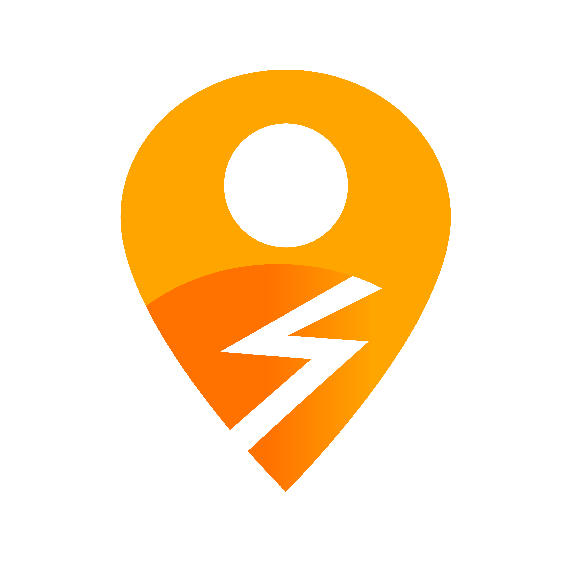

  <picture>
    <source media="(prefers-color-scheme: dark)" srcset="images/raiwo-logo-horizontal-branco.png">
    <source media="(prefers-color-scheme: light)" srcset="images/raiwo-logo-horizontal-preto.png">
    
  </picture>

   
   

  

    <strong>Conectando atletas • Organizando comunidades • Transformando o esporte brasileiro</strong>
  

  

    
    
    
  

 

## 👋 Bem-vindo à RAIWO

Esta organização reúne os repositórios que compõem a **RAIWO** - a plataforma que está transformando a forma como atletas se conectam e organizam suas atividades esportivas no Brasil.

### 🎯 Nossa Missão

Criar a maior comunidade de atletas organizados do Brasil, oferecendo uma plataforma completa que substitui grupos informais por experiências estruturadas, seguras e profissionais.

 

## 📦 Principais Repositórios

### 🌐 Frontend & Aplicações
Nossas aplicações web e mobile que conectam milhares de atletas

### 🔧 Backend & APIs
Serviços e APIs que alimentam a plataforma

### 📱 Mobile Apps
Aplicativos nativos para iOS e Android

### 🛠️ Ferramentas & Utilitários
Bibliotecas, scripts e ferramentas de desenvolvimento

 

## 🚀 Stack Tecnológica

| Categoria | Tecnologias |
|-----------|-------------|
| **Frontend** | Next.js 15 • React 19 • TypeScript • Tailwind CSS |
| **Backend** | Cloudflare Workers • Drizzle ORM • Better Auth |
| **Database** | Cloudflare D1 (SQLite) |
| **Storage** | Cloudflare R2 (S3-compatible) |
| **Payments** | Pagar.me • PIX |
| **Deploy** | Cloudflare Pages • GitHub Actions |

 

## 🌟 Destaques da Plataforma

🔍 **Descoberta Inteligente** - Encontre grupos por modalidade, localização e nível

✅ **Gestão Completa** - Presença digital, pagamentos e comunicação integrados

🛡️ **Segurança em Primeiro Lugar** - Rastreamento ao vivo, botão de emergência e perfis verificados

💳 **Pagamentos Simplificados** - PIX e cartão com cobrança automática

🏆 **Gamificação** - Conquistas, rankings e desafios para motivar atletas

📱 **PWA Mobile-First** - Funciona como app nativo em qualquer dispositivo

 

## 🤝 Contribuindo

Interessado em contribuir? Entre em contato conosco!

**📧 Contato:** dev@raiwo.com.br

 

## 📄 Licença

Os projetos desta organização são proprietários. Para informações sobre licenciamento, entre em contato com a equipe RAIWO.

 

---

  <picture>
    <source media="(prefers-color-scheme: dark)" srcset="images/raiwo-emblema-colorido.png">
    <source media="(prefers-color-scheme: light)" srcset="images/raiwo-emblema-colorido.png">
    
  </picture>

  
<strong>RAIWO</strong> - Democratizando o esporte através da tecnologia

  

    Feito com ❤️ para a comunidade esportiva brasileira
  

